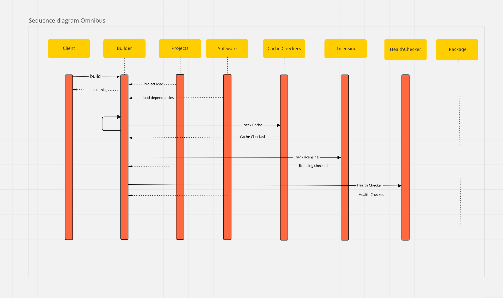

Omnibus

Omnibus is a tool for creating full-stack installers for multiple platforms. In general, it simplifies the installation of any software by including all the dependencies for that piece of software. Omnibus:– the framework, created by Chef Software, by which we create full-stack, cross-platform installers for software. The project is on GitHub.

Omnibus-software:– Chef Software’s open-source collection of software definitions that are used to build the Chef Client, the Chef Server, and other Chef Software products. The software definitions can be found on GitHub at

Back to the Omnibus DSL. Though bin/omnibus build demo will build the package for you, it will not do anything exciting. For that, you need to use the Omnibus DSL to define the specifics of your application.

1) Config

If present, Omnibus will use a top-level configuration file name omnibus.rb at the root of your repository. This file is loaded at runtime and includes number of configurations. For e.g.-

2) Project DSL

When you create an omnibus project, it creates a project DSL file inside config/project with the name which you used for creating project for above example it will create config/project/demo.rb. It provides means to define the dependencies of the project and metadata of the project. We will look at some contents of project DSL file

3) Software DSL
   Software DSL defines individual software components that go into making your overall package. The Software DSL provides a way to define where to retrieve the software sources, how to build them, and what dependencies they have. Now let’s edit a config/software/demo.rb

## Sequence Diagram
Reff: 

## Class Diagram
Reff:

**Client**

**Builder**
While calling builder different usefull class and methods invoked.
class CLI [From Omnibus gem]
Methods:
   def build (name)
class Project
Methods: 
   def load
   def download
   def build
   def package_me
   def compress_me

**Projects**
  Contains Packeger file.

**Software**
  Contains all dependency.

**Cache Checkers**
  Checks local or S3 cached cache.

**Licensing**
  

**HealthChecker**

**PKG**

